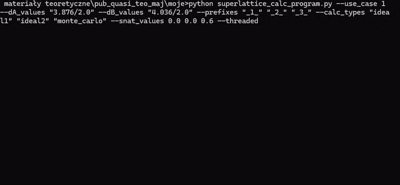
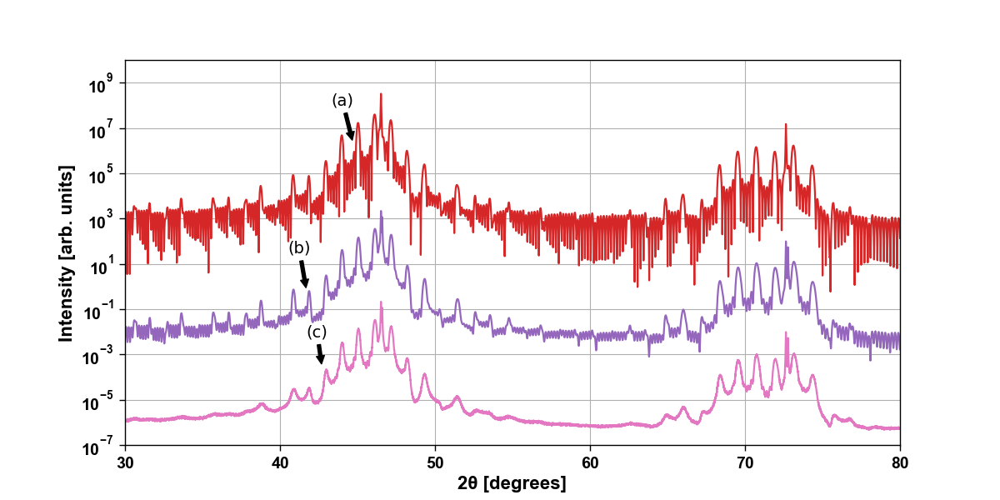

# 🧪 XRD Superlattice Simulator
**Python-based command-line tool for simulating and comparing X-ray diffraction (XRD) spectra** of perovskite-based superlattices like **LSMO/BTO** and **PTO** on **STO substrates**.

📊 The tool supports performance comparison of different simulation algorithms (e.g. ideal vs Monte Carlo) and generates plots, output files, and benchmark visualizations.

Used in a scientific publication on Monte Carlo-based modeling of superlattice XRD - Journal of Applied Crystallography.

---

## 🚀 Features

- ✅ Multiple calculation modes: `ideal` and `monte_carlo`
- ⚙️ Multi-threaded and sequential simulation modes
- 🔍 Configurable d-spacing, theta range, resolution and noise
- 🧩 5 predefined use cases (LSMO/BTO & PTO)
- 📈 Auto-generated plots and optional peak highlighting
- 🧪 Scientific-grade output ready for further analysis

---

## 📦 Requirements

- Python `3.11+`
- Install dependencies:
```bash
pip install -r requirements.txt
```

---

## ▶️ Basic Usage

Run the program from the Windows command line:

```commandline
python superlattice_calc_program.py --use_case <1–5> [options...]
```

### 🧰 Example (Use Case 1, LSMO/BTO simulation):

```commandline
python superlattice_calc_program.py --use_case 1 \
  --dA_values "3.876/2.0" \
  --dB_values "4.036/2.0" \
  --prefixes "_1_ _2_ _3_" \
  --calc_types ideal1 ideal2 monte_carlo \
  --snat_values 0.0 0.0 0.6
```

🎥 Program execution:



🩻 Generated results:


---

## 🔁 Available Use Cases

| Use Case | Description                                                     |
| -------- | --------------------------------------------------------------- |
| `1`      | LSMO/BTO comparison (30–80°): `ideal1`, `ideal2`, `monte_carlo` |
| `2`      | LSMO/BTO with different d-spacings in 60–80°                    |
| `3`      | Broad scan 10–120° with Monte Carlo on multiple structures      |
| `4`      | Internal test case using `geo_intensity_3` (40–50°)             |
| `5`      | PTO-based superlattice on STO (10–60°)                          |

---

## ⚙️ Arguments

| Flag            | Type  | Description                                              |
| --------------- | ----- |----------------------------------------------------------|
| `--use_case`    | int   | Required. Use case number (1–5)                          |
| `--divided`     | int   | Number of angle divisions (default: 3600)                |
| `--minTheta`    | float | Minimum theta (°) (default: 0.0)                         |
| `--angleLimit`  | float | Maximum theta (°) (default: 90.0)                        |
| `--divider`     | int   | Intensity scaling divisor (default: 1)                   |
| `--threaded`    | flag  | Use multi-threaded (not only) performance comparisons    |
| `--dA_values`   | list  | d-spacing for layer A (e.g. `"3.876/2.0"`)               |
| `--dB_values`   | list  | d-spacing for layer B (e.g. `"4.036/2.0"`)               |
| `--prefixes`    | list  | Output file name suffixes                                |
| `--calc_types`  | list  | Calculation methods: `ideal1`, `ideal2`, `monte_carlo`   |
| `--snat_values` | list  | Standard deviation of lattice fluctuations (for Monte Carlo) |

---

## 📄 Real Experimental Data Usage

This program also utilizes real experimental data obtained from an XRD measurement of the LSMO/BTO sample.

The data is stored in the file `sample_line_det.txt`.

- The measurement covers the theta angle range from 15° to 120°.
- This real dataset is used in Use Cases 1, 2, and 3 to simulate and analyze the diffraction spectra with actual measurement input.

This enables the program not only to generate theoretical spectra but also to compare and validate the simulations against true experimental results.

---

## 📌 Notes

- Some use cases generate multiple .txt output files and .png plots.
- `monte_carlo` calculations use `--snat_values` to simulate random layer distortions.
- Peak marking is automatically enabled in Use Case 2 (60-80°).
- **The program is in a very preliminary version and dynamically supports only selected execution scenarios.**

---

## 🧑‍🔬 Citation / Usage in Publications

This tool was used as the basis for XRD simulation in a scientific publication on superlattice structures using Monte Carlo methods.
For citation details, please use the doi:

`Ł. Kokosza, M. Marciszko-Wiąckowska, M. Przybylski and Z. Mitura (2025). J. Appl. Cryst. 58, https://doi.org/10.1107/S160057672500370X`