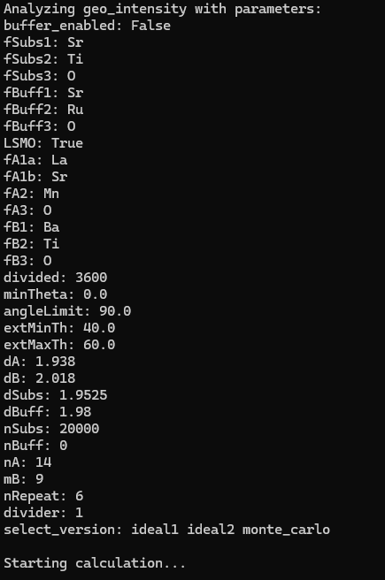
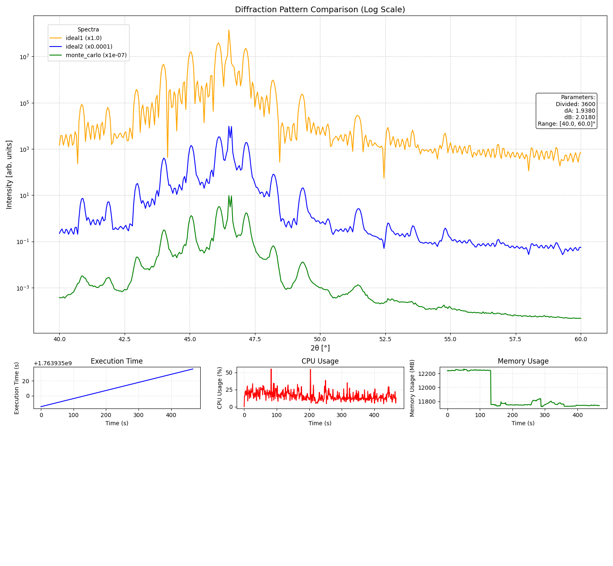

# 🧪 X-ray Spectra Generator
Python-based command-line tool for simulating X-ray diffraction (XRD) spectra of perovskite-based nanomaterials and superlattices, including LSMO/BTO on STO substrates.

The program allows fully parameterized simulations for both ideal crystal lattices and Monte Carlo-based structures with random distortions, enabling the study of how defects and fluctuations affect diffraction spectra.

Used as part of scientific research on Monte Carlo modeling of superlattice XRD — Journal of Applied Crystallography (**https://doi.org/10.1107/S160057672500370X**).

---

## 🚀 Features

- ✅ Fully configurable simulations – no predefined scenarios, full control over parameters

- 🧮 Ideal and Monte Carlo calculation modes

- ⚡ Includes a parallelized version utilizing all CPU cores for multithreaded computation (`x_ray_spectra_gen_parallel.py`).

- 📊 Performance reports after each run – execution time, CPU usage, and RAM usage graphs

- 📦 Built-in atomic_data database with experimental scattering coefficients for multiple elements (customizable)

- 🖼️ One combined result image – all plots in a single figure for easy comparison

- 🔬 Suitable for scientific-grade analysis and automated processing via CLI

---

## 📦 Requirements

- Python `3.11+`
- Install dependencies:
```bash
pip install -r requirements.txt
```

---

## ▶️ Basic Usage

### Standard (single-threaded)
Run a minimal simulation from the command line:

```commandline
python x_ray_spectra_gen.py --extMinTh 20 --extMaxTh 80 --select_version ideal1
```

### ⚡ Parallel (multi-threaded)
For faster calculation:
```commandline
python x_ray_spectra_gen_multithread_cpu.py --extMinTh 20 --extMaxTh 80 --select_version ideal1
```

### 🎛️ Advanced Usage Example
Example with full parameterization:

```commandline
python x_ray_spectra_gen.py --extMinTh 40 --extMaxTh 60 --divided 3600 --minTheta 0.0 --angleLimit 90.0 --dA 1.938 --dB 2.018 --dSubs 1.9525 --dBuff 1.98 --nSubs 20000 --nBuff 0 --nA 14 --mB 9 --nRepeat 6 --select_version "ideal1 ideal2 monte_carlo" --buffer_enabled False --LSMO True --fSubs1 "Sr" --fSubs2 "Ti" --fSubs3 "O" --fBuff1 "Sr" --fBuff2 "Ti" --fBuff3 "O" --fA1a "La" --fA1b "Sr" --fA2 "Mn" --fA3 "O" --fB1 "Ba" --fB2 "Ti" --fB3 "O"
```

🎥 Program execution:



🩻 Generated results:


---

## ⚙️ Arguments

| Flag                                 | Type  | Description                                                     |
| ------------------------------------ | ----- |-----------------------------------------------------------------|
| `--divided`                          | int   | Number of angle divisions (default: 3600)                       |
| `--minTheta`                         | float | Minimum theta (°) (default: 0.0)                                |
| `--angleLimit`                       | float | Maximum theta (°) (default: 90.0)                               |
| `--extMinTh`                         | float | Minimum displayed angle (°) (default: 30.0)                     |
| `--extMaxTh`                         | float | Maximum displayed angle (°) (default: 60.0)                     |
| `--dA`                               | float | d-spacing for layer A                                           |
| `--dB`                               | float | d-spacing for layer B                                           |
| `--divider`                          | int   | Intensity scaling divisor (default: 1)                          |
| `--select_version`                   | str   | Calculation modes: `ideal1`, `ideal2`, `monte_carlo` (required) |
| `--dSubs`                            | float | Substrate d-spacing                                             |
| `--dBuff`                            | float | Buffer d-spacing                                                |
| `--nSubs`                            | int   | Number of substrate layers                                      |
| `--nBuff`                            | int   | Number of buffer layers                                         |
| `--nA`                               | int   | Number of A-site layers                                         |
| `--nB`                               | int   | Number of B-site layers                                         |
| `--nRepeat`                          | int   | Number of superlattice repeats                                  |
| `--bulk_or_s`                        | str   | Output filename suffix                                          |
| `--buffer_enabled`                   | bool  | Enable buffer layer (default: True)                             |
| `--LSMO`                             | bool  | Use LSMO composition (default: True)                            |
| `--fSubs1`–`--fSubs3`                | str   | Elements in substrate (default: Sr, Ti, O)                      |
| `--fBuff1`–`--fBuff3`                | str   | Elements in buffer (default: Sr, Ti, O)                         |
| `--fA1a`, `--fA1b`, `--fA2`, `--fA3` | str   | Elements in A-site                                              |
| `--fB1`, `--fB2`, `--fB3`            | str   | Elements in B-site                                              |

---

## 📌 Notes

- The atomic_data file can be extended with new elements to create custom superlattice structures.

- Resource usage graphs show total system usage (including other running processes).

- Even though this is a simplified public release, it allows virtually unlimited XRD simulation configurations.

- All results are saved as a single combined image containing diffraction spectra and performance metrics.

- The parallel version (`x_ray_spectra_gen_multithread_cpu.py`) splits the angle range into chunks processed by separate CPU cores.

- A high-performance CUDA-accelerated version is located in the cuda_gpu/ directory for users with NVIDIA graphics cards.
---

## 🧑‍🔬 Citation / Usage in Publications

This tool was used as the basis for XRD simulation in a scientific publication on superlattice structures using Monte Carlo methods.
For citation details, please use the doi:

`Ł. Kokosza, M. Marciszko-Wiąckowska, M. Przybylski and Z. Mitura (2025). J. Appl. Cryst. 58, https://doi.org/10.1107/S160057672500370X`